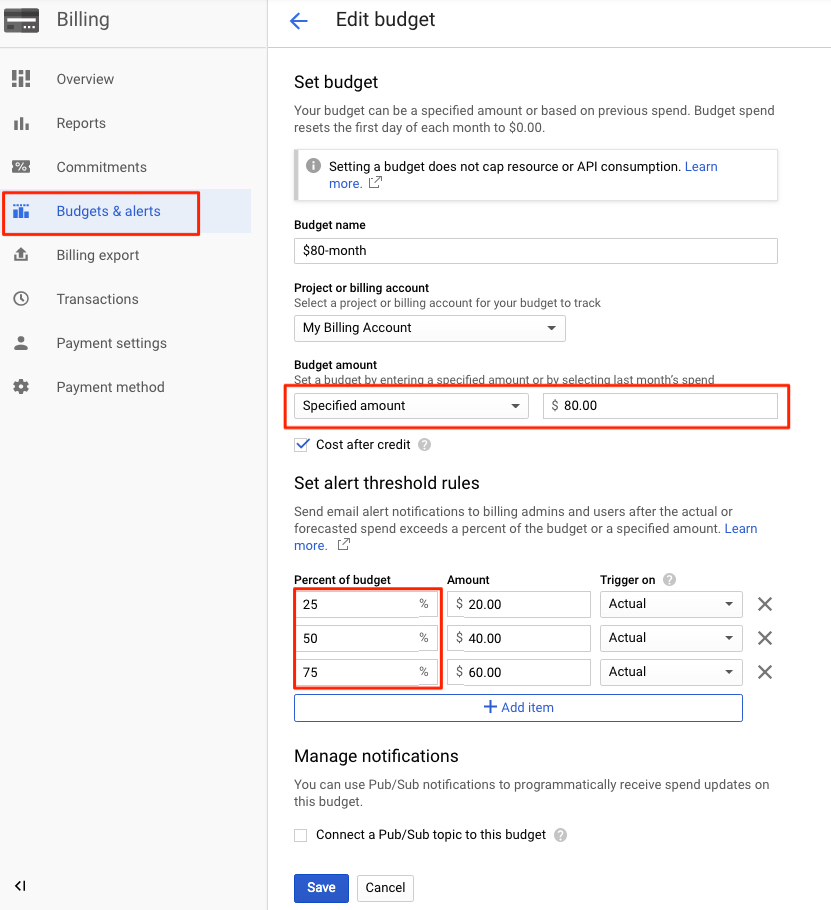
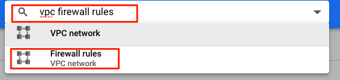
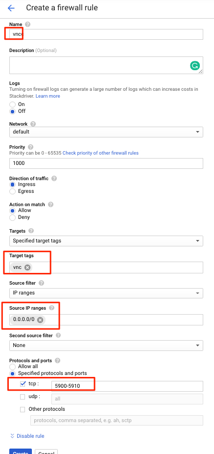
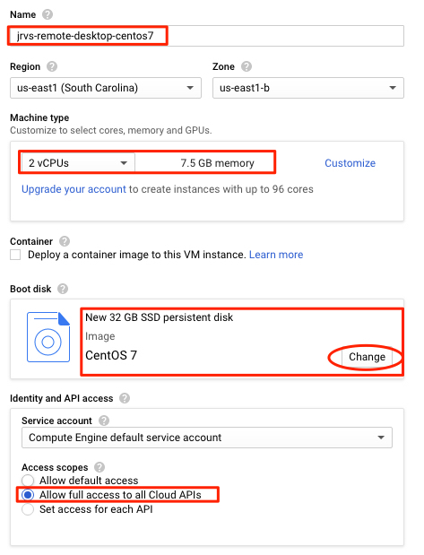
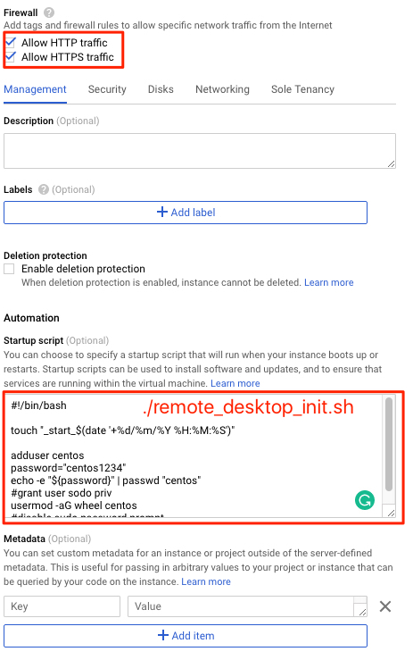
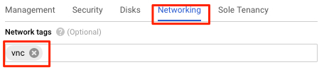
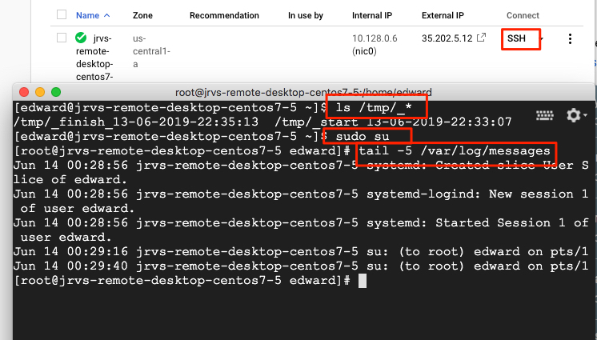
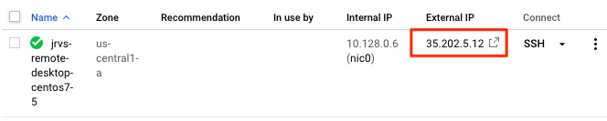
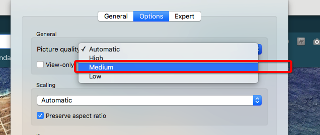
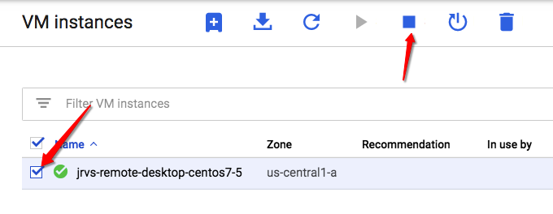

[TOC]
# Setup a Buget Alarm

Step 1


Step 2



# Jarvis Remote Desktop with GCP

Jarvis Remote Desktop (JRD) is a CentOS 7 based server which is installed with the following softwares

- `VNC` (Virtual Network Computing) is a technology for remote desktop sharing, a form of remote access on computer networks.
- `Xfce` is a lightweight desktop environment for UNIX-like operating systems. It consumes only about 256mb memory.
- `Chrome`
- `openjdk 1.8.0`
- Utilities: vim htop tree wget git terminator maven

Prerequisites:

- Sign up GCP. You will need a personal credit credit card. You will get a $300 USD credit for a year. https://cloud.google.com/free/
- A personal GitHub account ( private repos are free now!)

## Setup firewalls
- In GCP console, search for  `vpc firewall rules`
  

- Click `CREATE FIREWALL RULE`

- Configuration

  ```properties
  Name=vnc
  Targets=Specific target tags
  Target tags=vnc
  Source IP ranges=0.0.0.0/0
  Protocals and ports > tcp=5900-5910
  ```

  

- Click `CREATE`

## Creating a VM Instance

* Menu > Comupte Engine > VM instances

* Create an instance

  ```markdown
  *Screenshot 1*
  Name=jrvs-remote-desktop-centos7
  Region=us-east1
  Zone=us-east1-c
  Machine type
    cores=2
    Memory=7.5
  Boot disk=`centos7` & `SSD=32GB`
  
  *Screenshot 2*
  Check `Allow Full access to all Cloud APIs`
  Check `Allow HTTP traffic`
  Check `Allow HTTPS traffic`
  
  Click `Management, security, disks, networking, sole tenancy
    - copy `./remote_desktop_init.sh` to startup script text box
  
  *Screenshot 3*
  In Network tab, set `Network tags=vnc`
  
  Click `CREATE` button
  ```

  **Screenshot 1:**
  

  **Screenshot 2**
  

  **Screenshot 3**
  

* Verify startup script
  
  * Connect to the instance using the SSH buttom
  
  ```bash
  ls /tmp/_*
  
  #/tmp/_start_{datetime} file indicate startup script start time
  #/tmp/_finish_{datetime} file indicate startup script finish time
  
  #If you dont see _finish_{datetime} file in a while..go to troubleshooting section.
  ```
  
  

### Troubleshooting

https://cloud.google.com/compute/docs/startupscript

Use console `ssh` button to connect to the server

```
startup script log file
CentOS and RHEL: /var/log/messages
```

## Accessing JRD

* Install `RealVNC` viewer

* Add new connection

  ```
  #find external IP by click the instance details
  #this external IP is not static. It will change if you stop/start the instance
  35.224.241.10:5901
  ```

  

* Change VNC resolution to your laptop display resolution

  ```
  xrandr --fb 1440x900
  ```

* Change picture quaility if connection is slow



### Troubleshooting

* 1. Check vncserver service status

  2. `sudo systemctl status vncserver@:1.service`

  3. Check current running vncserver displays

  4. `vncserver -list`

  5. Vncserver log and config location

  6. `cd ~/.vnc/` 

## Configuring JRD

Default password for `centos` user is `centos1234`

(Optional) Update password for `centos` user

```bash
#set a password for current user
passwd

vim ~/accounts
#Write down your password 
#(bad practice, do not do this in production)
```

### Install Docker

```bash
sudo su
yum -y install docker
groupadd docker
usermod -aG docker centos
#must reboot
reboot
#systemctl start docker
```

Verify `docker`

```bash
#run as `centos` user
su centos

#verify
systemctl status docker
#start
systemctl start docker

#run this as centos user
docker run hello-world

#shut it down to save CPU/RAM
systemctl stop docker

#more useful cmds
#systemctl status|start|restart|stop docker
```

### Install Intellij

* Download Intllij Community version
  (or Ultimate version if you bring your own liscense)

```bash
cd ~/Downloads
tar xzf ideaIC-2019.1.3.tar.gz
mkdir ~/apps
mv idea-IC-191.7479.19 ~/apps
cd ~/apps/idea-IC-191.7479.19/

#diable android and swing plugins
#install scala plugin
#Ignore `XFCE PolicyKit Agent` auth if failed

```

### Stop Instance

GCP charges running instances by minutes. 2vCPU and 7.5GB will cost you around $50-55 per month. Therefore, make sure you stop your instance every day to save costs. 



When you restart your instance next time. You will get a **new** external/public IP, so make sure you update your VNC connection IP address. 

